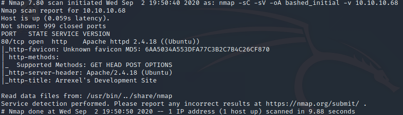

# HackTheBox: Bashed
## Walkthrough Report for OSCP Practice

> Author: shinigami
> Date: 2AUG2020

### 1.0 HackTheBox: Bashed OSCP Practice Report
#### 1.1 Executive Summary
I was tasked with solving the _Bashed_ machine.
Solving this machine requires finding the contents
of two files that can be found on the system and
reporting that information to the _HackTheBox_
website. The focus of these efforts is to solve
machines found on a list by Twitter user `@TJ_Null`
in order to practice for the _Offensive Security:
Penetration Testing With Kali_ course and _OSCP_
exam. My overall focus was to ensure that I am
able to perform proper techniques to solve the
listed machines whilst properly taking notes and
writing a report.

When solving the _Bashed_ machine, there were a
few noteworthy things that were identified, thus
allowing me to solve the machine. While performing
attacks I was able to gain access to the machine
and elevate to root privileges. This is primarily
due to poor permissions practices and security
configurations. This machine was successfully
exploited and I was able to achieve super user
privileges. 

#### 1.2 Recommendations
I recommend removing the _phpBash_ program from
any public facing machine, and securing the `/dev`
subdirectory on those machines so that attackers are
not able to see the contents therein. I also recommend
reviewing all `sudo` privileges on this machine and
ensuring that the _Principle of Least Privilege_ is
followed. My final recommendation is to review all
`cron` jobs and ensure that any script that is to
be run as root is not arbitrarily writable by non-root
users.

### 2.0 Methodologies
I followed a common methodology used to perform penetration
tests in attempts to solve this machine. The following
sections detail this process and how I was able to solve
the machine.

#### 2.1 Information Gathering
The information gathering portion of penetration tests is
normally used to identify the scope of the penetration
test. _HackTheBox_ provides the scopes for it's machines
in the form of the corresponding IP address, which is only
accessible via VPN access into their network. The specific
IP address of the _Bashed_ machine is `10.10.10.68`.

#### 2.2 Penetration
The penetration portion of the assessment is mainly focused
on gaining access to the in scope targets and elevating
privileges. During my efforts in solving this machine, I
was able to gain access and elevate privileges to root.

##### Service Enumeration
Service enumeration is a vital portion of penetration tests
as it provides information on potential attack vectors that
attackers could exploit. An understanding of these services
allow penetration testers to take methodical steps in order
to gain access to in scope targets. 

Asset | Open Ports
----- | ----------
10.10.10.68 | TCP: 80
 | UDP: Not scanned

1. **Nmap**
`nmap` is an industry standard tool used to scan machines
and networks for open ports and service enumeration. In this
vain, I used `nmap` in oder to enumerate open TCP ports and
use the given information to determine a potential OS version.



This `nmap` scan says that the target machine is an Ubuntu host.
I could determine that the machine was hosting the Xenial version
of Ubuntu from the version of Apache that was determined by the
scan.

2. **Web Browsing and Subdirectory Enumeration**
My `nmap` scan reports that port 80 is open and is hosting an
Apache HTTP server, which is a web server. Navigating to the
webpages hosted on the Apache server lead us to what seems to
be a blog post about a PHP web based shell.


The information that was found on these pages alone were not
enough to attack the machines, thus I needed to resort to other
methods to find attack vectors. I used the tool `gobuster`, which
allows me to bruteforce find subdirectories of the web server.


Using the output from `gobuster`, I was able to find the `/dev`
subdirectory for the webserver, which contained two php scripts.
These scripts were named along the lines of the blog post that
was found earlier.


##### Initial Access
In the `/dev` subdirectory of the webserver on the target machine,
the PHP script `phpbash.php` opens a web-based shell onto the target
machine.


Using this web-based shell, I was able to give myself reverse shell
access by downloading a BASH shell script into the `/tmp` directory of
the victim machine and executing it.


Now that I had a reverse shell onto the machine as user `www-data`, I began to enumerate
for potential vectors for privilege escalation. To do this, I used a
shell script called [linPEAS](https://github.com/carlospolop/privilege-escalation-awesome-scripts-suite/tree/master/linPEAS).
Using this script allowed me to determine other users on the machine,
check their home directories, and see that the user `arrexel` has the
`user.txt` file that is needed to report back to _HackTheBox_.


When performing some deeper analysis of `arrexel`'s home directory,
I was able to see that the `user.txt` file is globally readable, thus
meaning I can read it's contents and report back to _HackThBox_.


##### Privilege Escalation
The `linPEAS` script was able to find that the low-privileged user
`www-data` is able to run commands as the user `scriptmanager` with
the `sudo` prefix and no password required. 


Using this lack of a password requirement, I was able to escalate to
the `scriptmanager` user using the following command.
```bash
sudo -u scriptmanager -i
```


After becoming the user `scriptmanager`, I began looking into other
things that were found by the `linPEAS` script. The most noteworthy
finding is that there is `/scripts` directory in the `/` directory
of the machine. This is particularly odd, as this is not a system
default.


When performing deeper investigation on this directory, I could
see that it is owned by the `scriptmanager` user.


The contents of this directory include a Python script and a plaintext
file. The Python script is owned by the `scriptmanager` user and the
plaintext file is owned by `root`. 


While looking into the contents of both of these files, it can be determined
that the plaintext file could have been generated by the Python script.


When further investigating the `test.txt` file owned by `root`, I noticed the
date of creation is very recent, and even get updated regularly.


This consistent changing of dates causes me to suspect that there is a
`cron` job running as `root` that executes the Python script. We can
exploit this by replacing the contents of the Python file with a Python-based
reverse shell, which should give us super user access to the machine if
my suspicions are correct.


Now that I have a root shell, I am able to retrieve the final file
from the `/root` directory on the machine. 


#### 2.3 Maintaining Access
Should an attacker want to maintain access to this machine, no extra work
is needed. The reverse shell payload is automatically run by the system
due to a `cron` job.

#### 2.4 House Cleaning
The House Cleaning portion of the assessment is very important, as it
ensures that the attackers do not leave behind any unwanted files, users,
exploits, etc.
After collecting all required materials to "complete" the machine, the
author appropriately removed any traces of attacks performed on the system.
