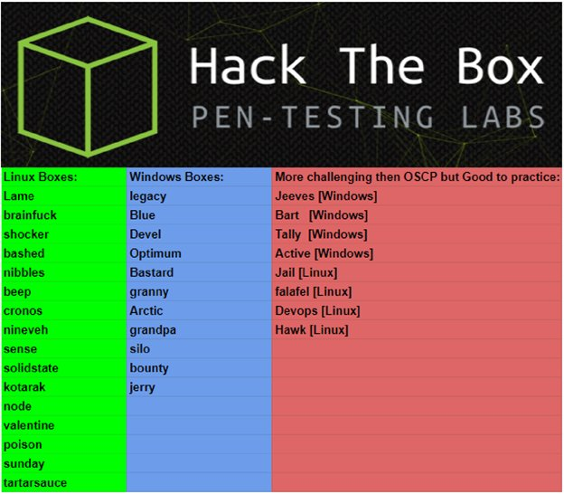

# HackTheBox retired machine OSCP Prep
Collection of notes and writeups for TJ\_Null's
OSCP list of machines to prepare for the OSCP.

## Boxes
- [ ] Bashed
- [ ] Nibbles
- [ ] Sense
- [ ] Node
- [ ] Valentine
- [ ] Poison
- [ ] Sunday
- [ ] Brainfuck
- [ ] CronOS
- [ ] Nineveh
- [ ] SolidState
- [ ] Kotarak
- [ ] Tartarsauce
- [ ] Blue
- [ ] Devel
- [ ] Optimum
- [ ] Bastard
- [ ] Silo
- [ ] Bounty
- [ ] Jerry
- [ ] Jeeves
- [ ] Bart
- [ ] Tally
- [ ] Active
- [ ] Jail
- [ ] Falafel
- [ ] DevOops
- [ ] Hawk
- [ ] Conceal
- [ ] Irked
- [ ] Netmon
- [ ] FriendZone
- [ ] LaCasaDePapel
- [ ] LightWeight
- [ ] Networked
- [ ] Safe
