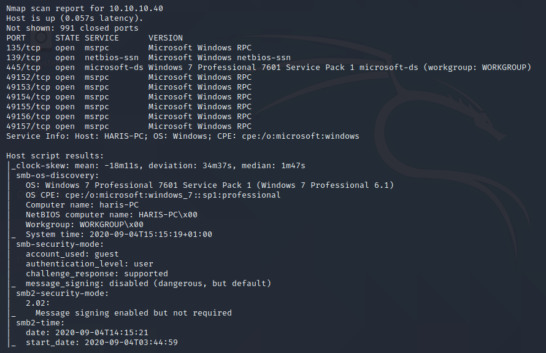
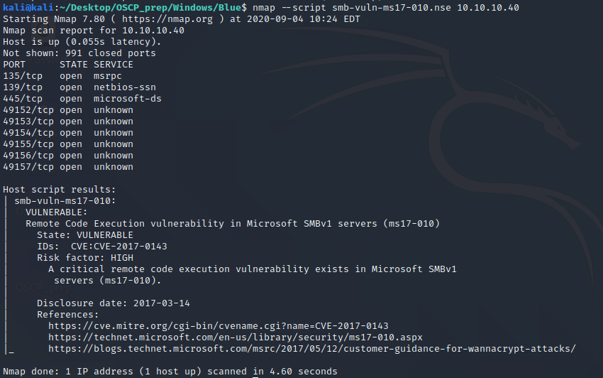
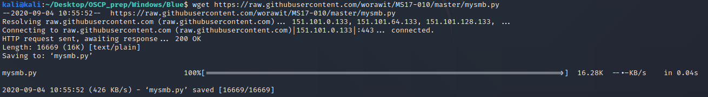
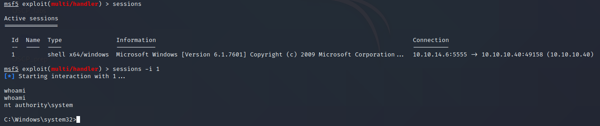
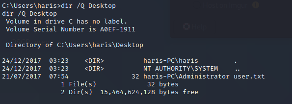
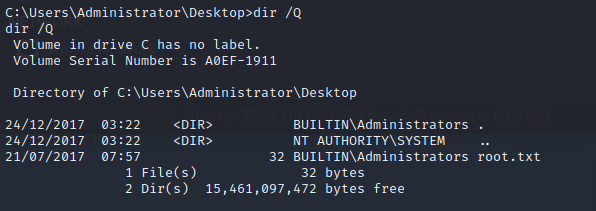

# HackTheBox: Blue
## Walkthrough Report for OSCP Practice
> Author: shinigami Date: 3AUG2020

### 1.0 HackTheBox: Blue OSCP Practice Report
#### 1.1 Executive Summary
I was tasked with solving the _Blue_ machine from _HackTheBox_. Solving
this machine involves retrieving the contents of two files found on the
system and reporting said contents to the _HackTheBox_ website. The focus
of these efforts is to solve machines found on a list by Twitter user `@TJ_Null`
in order to practice for the _Offensive Security: Penetration Testing with Kali_
course OSCP exam. My overall focus was to ensure that I am able to perform proper
techniques to sovle the listed machines whilst properly taking notes and writing
a report.

When solving the _Blue_ machine, there were a few noteworthy things identified,
thus allowing me to solve the machine. While performing attacks I was able to gain
access to the machine and elevate to root privileges. This is primarily due to poor
permissions practices and security configurations. This machine was successfully
exploited and I was able to achieve super user privileges. 

#### 1.2 Recommendations
I recommend performing the Microsoft security patches regarding MS17-010, or preferably
updating the operating system to a more recent version of Windows 10 with the current
security patches.

### 2.0 Methodologies
I followed the common methodology used to perform penetration tests in attempts to solve
this machine. The following sections detail this process and how I was able to solve the
machine.

#### 2.1 Information Gathering
The information gathering portion of penetration tests is normally used to identify the
scope of the penetration test. _HackTheBox_ provides the scopes for it's machines in the
form of correspondin IP addresses, which is only accessible via CPN access into their
network. The specific IP address of the _Blue_ machine is `10.10.10.40`.

#### 2.2 Penetration
The penetration portion of the assessment is mainly focused on gaining access to the in
scope target(s)  and elevating privileges. During efforts in solving this machine, I was
able to gain access and elevate privileges to `NT Authority\System`.

##### Service Enumeration
Service enumeration is a vital portion of penetration tests as it provides information on
potential attack vectors that attackers could exploit. An understanding of these services
allow penetration testers to take methodical steps in order to gain access to in scope
targets.
| Asset | Open Ports|
| ----- | ----- |
| 10.10.10.40 | TCP: 135, 139, 445, 49152, 49153, 49154, 49155, 49156, 49157|
| | UDP: Not scanned|

1. **Nmap**

`nmap` is an industry standard tool used to scan machines and networks for open ports and
service enumeration. In this vain, I used `nmap` to enumerate open TCP ports and use the
given information to determine an OS.

This `nmap` scan says that the OS version is Windows 7 SP1 via `nmap`'s SMB OS discovery
module. Using this knowledge, I immediately thought to test the machine for vulnerability
to [MS17-010](https://docs.microsoft.com/en-us/security-updates/securitybulletins/2017/ms17-010).

This scan says that the machine is vulnerable to a MS17-010 exploit, which is enough to begin
building out an attack against the target.

##### Initial Access and Privilege Escalation
Given that the machine scans as vulnerable to MS17-010 attacks, it is reasonable to start
with confirming this by attempting to exploit the vulnerability. It is important to know
that the MS17-010 exploit, commonly known as _Eternal Blue_, is a kernel exploit for Windows,
which means that knowing the architecture of the vulnerable machine is necessary. `nmap` did
not identify the architecture of the target machine, thus we must try both 32 and 64-bit
architecture exploits. 

There is a [Github repo](https://github.com/REPTILEHAUS/Eternal-Blue)
that is able to simultaneously exploit 32 and 64-bit architecture machines by combining the
respective payloads. This repo has a few dependencies that must be installed before it can
properly work. Namely, these dependencies are `impacket`, which can be installed via `pip`
and `mysmb.py`, which can be found [here](https://github.com/worawit/MS17-010/blob/master/mysmb.py).

Following the instructions given in the exploit's `README.md` file, allow us to get a reverse
shell to the target machine. 

In the above screenshot, you can see that the shell grantedis for user `NT Authority\System`, which
is an Administrative user that is built-in to Windows systems. Since this is an administrative user,
we are able to read both the user and root files.

#### 2.3 Maintaining Access
Should an attacker want to maintain access to this machine, further work is required. The attacker
would have to perform post-exploitation work in order to ensure their persistence. Given that the
attacker would have a reverse shell as `NT Authority\System`, the attacker can perform actions with
limited to no restrictions.

#### 2.4 House Cleaning
The House Cleaning portion of the assessment is very important, as it
ensures that the attackers do not leave behind any unwanted files, users,
exploits, etc.
After collecting all required materials to "complete" the machine, the
author appropriately removed any traces of attacks performed on the system.